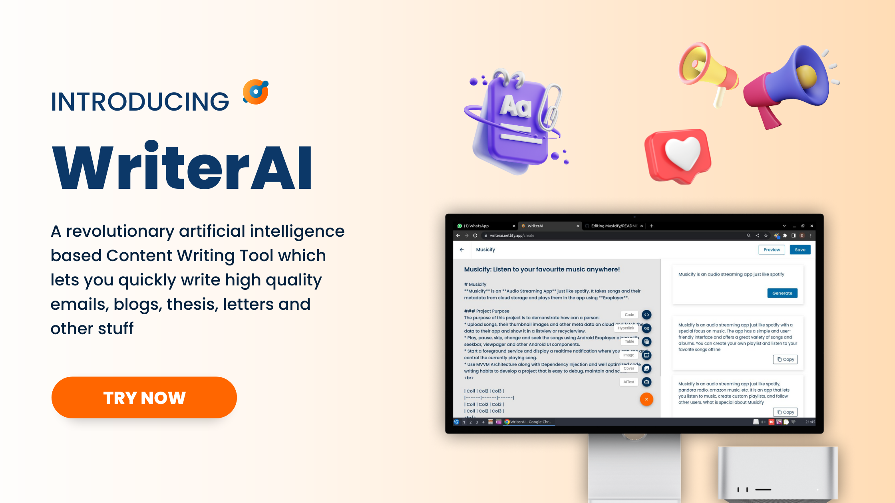
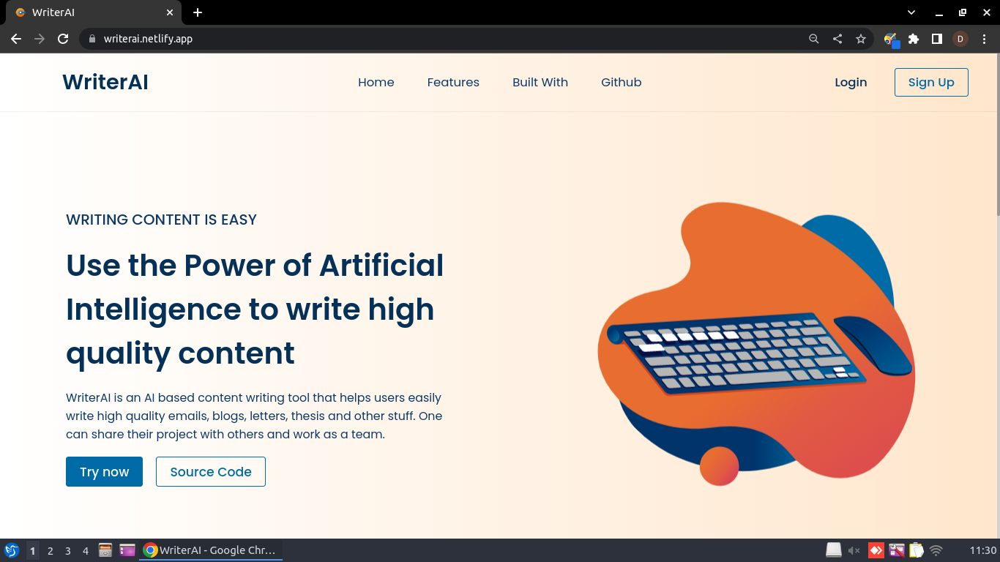
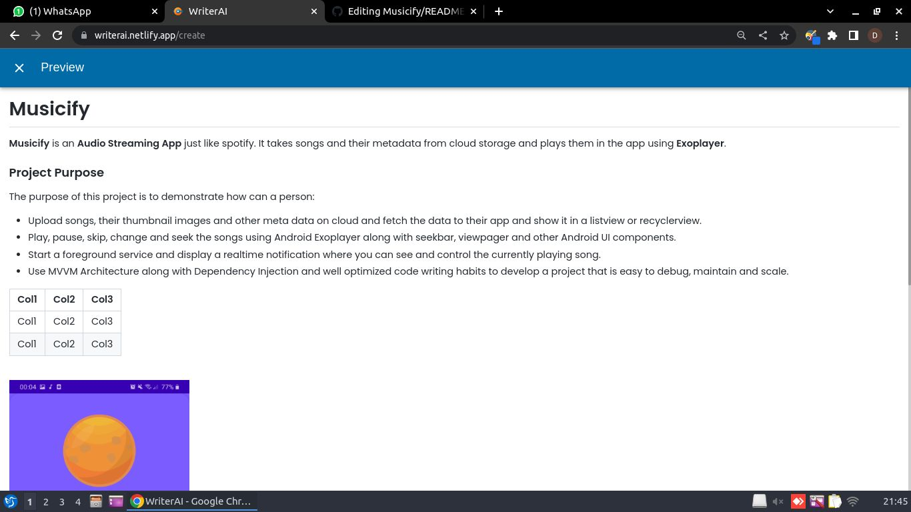
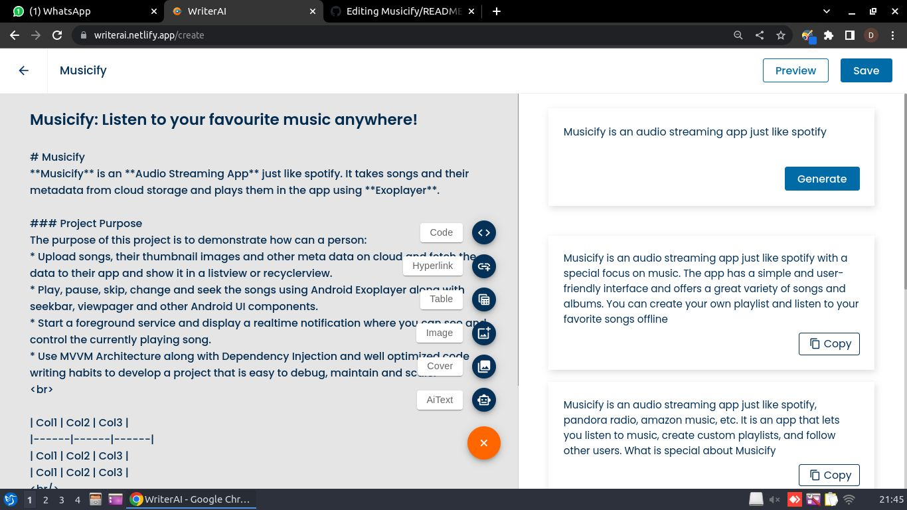
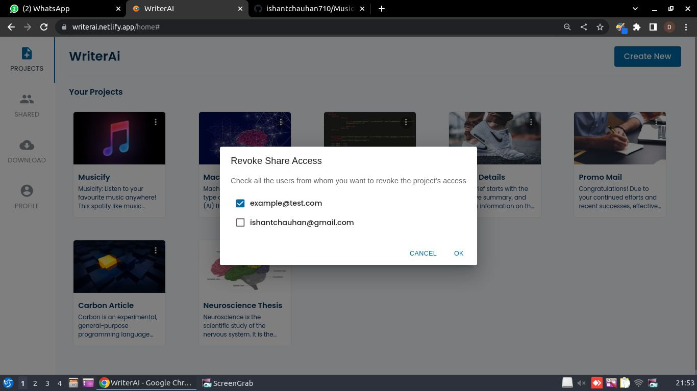
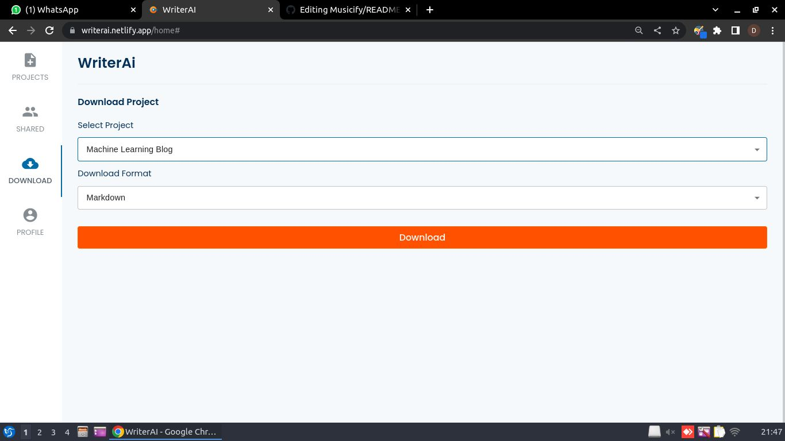

# **WriterAI** 

**WriterAI** is an AI based content writing tool that helps users easily write high quality emails, blogs, letters, thesis and other stuff. One can also share their project with others and work as a team.

This project is developed by **Team 404** for Hashnode x PlanetScale hackathon. This team comprises of [Ishant](https://github.com/ishantchauhan710/) and [Vaibhav](https://github.com/Vaibhav2002).

## About

WriterAI is a web app where a user can make use of artificial intelligence to quickly write high quality content. Just provide the AI with a sample input of one to two lines and the AI will generate 5 different paragraphs for you!

## Website Demo

You can try this website by clicking on the link below 👇

[https://writerai.netlify.app/](https://writerai.netlify.app/)

## WriterAI Features

- **Auto Text Completion** - Generates over 120 words with an input of just 5 words
- **Inbuilt Text Editor** - For writing your blogs, emails, thesis, letters and other release
- **Project Sharing** - You can share your project with unlimited number of users and work in teams
- **Markdown Support** - You can add images, tables, hyperlinks and code snippets in your projects by using markdown
- **Project Download** - You can download your projects in JSON, XML and Markdown format
- **User Authentication** - Supports Email-Password authentication and Gmail authentication
- **User Authorization** - WriterAI keeps on validating the user's auth tokens every 5 minutes automatically

## Technical details

- The frontend of WriterAI is created using technologies like CSS, ReactJS and MaterialUI. WriterAI is highly responsive and is tested on all popular browsers like Chrome, Safari and Opera Mini. For handling the react state\s, ContextAPI is used. The frontend code is highly structured and BEM convention is followed throughout the entire CSS code.

- The backend of WriterAI is built using Ktor which is a Kotlin based framework for writing server side code! For storing the user's data, we have used PlatenScale which is a highly scalable MySQL database platform which supports horizontal sharding and unlimited connections. For authentication, we have used Firebase SDK. And for deployment of the backend, we have used Linode.

## 📸 Screenshots 

|   |   |   |
|---|---|---|
||  | 
| |  | 
|| | 

## Setup [Frontend]
If you want to clone this project and customize it further, you need to do a couple of tasks first:
* Clone this project. You can directly download the source code, or you can use the CLI in terminal
* Once successful, open your terminal in the project folder and write npm install
* After this, in the root folder of the project, create a new file with the exact name of ".env"
* In the .env file, write:<br><br>

```
REACT_APP_FIREBASE_API_KEY=XXXXXXXX
REACT_APP_FIREBASE_AUTH_DOMAIN=XXXXXXXX
REACT_APP_FIREBASE_PROJECT_ID=XXXXXXXX
REACT_APP_FIREBASE_STORAGE_BUCKET=XXXXXXXX
REACT_APP_FIREBASE_MESSAGING_SENDER_ID=XXXXXXXX
REACT_APP_FIREBASE_APP_ID=XXXXXXXX
REACT_APP_FIREBASE_MEASUREMENT_ID=XXXXXXXX
REACT_APP_AI_API_KEY=XXXXXXXX
REACT_APP_BASE_URL=XXXXXXXX
```
* Get the value of first 7 variables by creating a firebase account, enabling user authentication and downloading the firebase configuration json file
* Get the API key to enable AI support from OpenAI
* Get a domain and enable SSL on it in order to use it. Not doing so may result in CORS errors. See backend documentation for more.
* Save the file and then in frontend and backend terminal, write npm start and enjoy the project :)

## Setup [Backend]
For this, you can refer to the [Backend Repository](https://github.com/Vaibhav2002/WriterAI-Backend) of WriterAI to setup the backend server


